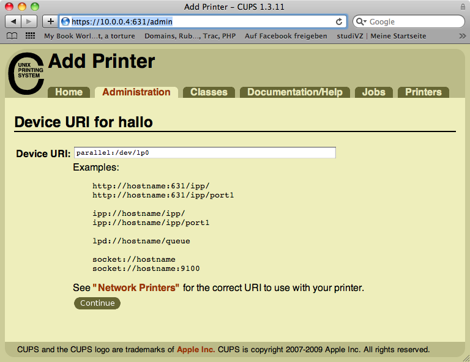
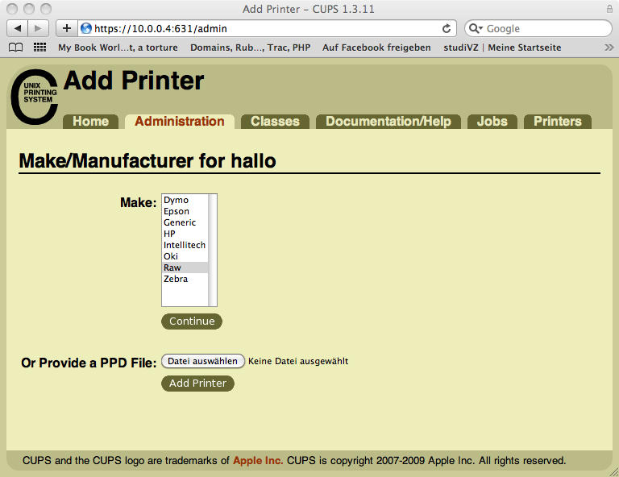
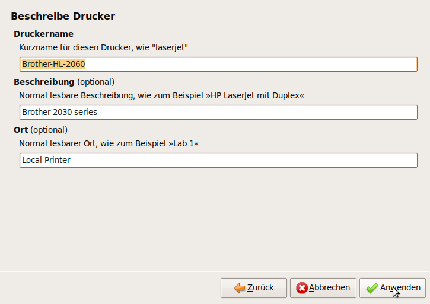
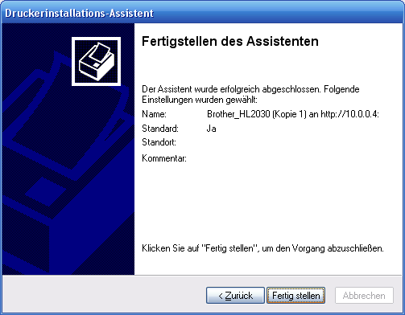
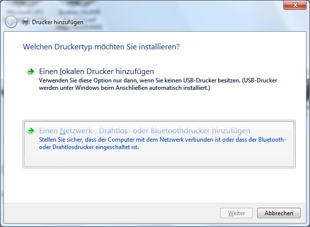
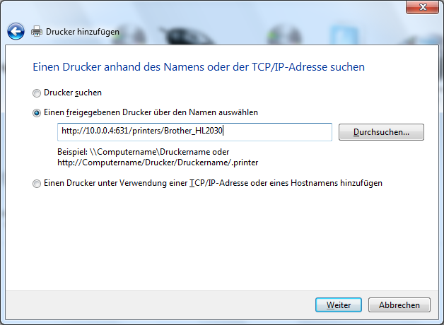

MyBook World Edition White Light Print Server
====

**Mit Firmware 01.00.16, 01.00.18 und 01.01.16 getestet!**

### Updates: ###

* Firmware 01.01.16 getestet
* Firmware 01.00.18 getestet
* Addgroup hinzugefügt
* Testseitendruck
* Drucker mit Webinterface hinzufügen

Danke an **mad_ady** und **Fidatelo** von [mybookworld.wikidot.com](http://mybookworld.wikidot.com/forum/t-180724/cups-on-mybook-we-white-light-a-torture#post-608513) für ihr Feedback!

## Vorbereitungen ##

Als allererstes muss, wenn nicht bereits geschähen, SSH im Webinterface aktiviert werden. Dann kann man sich z.B. mit Putty auf der Konsole einloggen. (User: root / Passwort: welc0me)
Zunächst wird die MBWE für Optware vorbereitet werden. Am einfachsten geht dies mit dem Script von Frater, das auch noch einige andere Optimierungen vornimmt:

	wget -O prep_whitelight http://wd.mirmana.com/prep_whitelight
	sh prep_whitelight

Dies nimmt einige Zeit in Anspruch und es werden viele Pakete heruntergeladen und installiert. Anschließend sollte Crond deaktiviert werden damit die Festplatten nicht alle 15 min anlaufen.

## Installation von CUPS ##

Mittlerweile kann cups direkt aus den Paketquellen installiert werden und man muss nichts selber kompilieren. Einfach folgendes als root auf der MBWE Konsole ausführen:

	/opt/bin/ipkg install cups
	/opt/bin/ipkg install cups-pdf
	/opt/bin/ipkg install cups-doc
	/opt/bin/ipkg install cups-driver-gutenprint

Wobei cups-doc für das Webinterface von cups benötigt wird. In diesen Moment ist cups bereits startfähig, allerdings kann es nicht die angeschlossenen USB Drucker finden. Dazu wird ein Kernelmodule benötigt.

## Kernelmodul installieren ##

Das Module wurde von mir aus den Western Digital Quellen kompiliert. Um euch diese Arbeit zu ersparen könnt ihr das Module hier herunterladen bitte nur Kernel 2.6.24.4 verwenden.

	mkdir /lib/modules/2.6.24.4/kernel/drivers/usb/class/
	wget https://github.com/berwinter/mbwe/blob/master/modules/usblp.ko.whitelight?raw=true -O /lib/modules/2.6.24.4/kernel/drivers/usb/class/usblp.ko 

Das Module kann jetzt mit insmod geladen werden. Allerdings werden dann die Datei rechte falsch vergeben. Dazu verwenden wir ein Startscript, dass bei Systemstart alle Einstellungen vornimmt und cups startet.

Dazu erstellen wir die Datei /opt/etc/init.d/_SK88cupsd mit folgendem Inhalt:

	#!/bin/sh
	#
	#
	#
	case "$1" in
		start)
		        if ( [ ! -c /dev/lp0 ] ) then
		                mknod /dev/lp0 c 180 0
		        fi
		        /bin/chown sys:lp /dev/lp0

		        if ( !(lsmod | grep "^usblp" -q) ); then
		                 insmod /lib/modules/2.6.24.4/kernel/drivers/usb/class/usblp.ko
		        fi

		        if [ -n "`pidof cupsd`" ]; then
		                /usr/bin/killall cupsd 2>/dev/null
		        fi
		        /opt/sbin/cupsd
		;;
		stop)
		        if [ -n "`pidof cupsd`" ]; then
		                /usr/bin/killall cupsd 2>/dev/null
		        fi
		;;
		*)
		        echo "Usage: (start|stop)"
		        exit 1
	esac

Abschließend noch ausführbar machen und die Startup und Shutdown links setzen:

	chmod +x _SK88cupsd
	ln -s _SK88cupsd S88cupsd
	ln -s _SK88cupsd K88cupsd

Eventuell muss noch die Gruppe lp angelegt werden (wenn noch nicht vorhanden):

	addgroup lp

## CUPS konfigurieren ##

Dazu die Datei /opt/etc/cups/cupsd.conf öffnen und entsprechend ändern:

	# Show general information in error_log.
	LogLevel info
	MaxLogSize 100000
	MaxJobs 50
	User sys
	Group lp
	# Allow remote access
	Port 631
	MaxClients 10
	<Location />
	  Encryption Never
	  AuthType None
	  Deny From All
	  Allow From 127.0.0.1
	  Allow From 10.0.0.0/16
	  # Allow shared printing and remote administration...
	  # Order allow,deny
	  # Allow @LOCAL
	</Location>
	<Location /printers>
	  AuthType None
	  Order Deny,Allow
	  Deny From None
	  Allow From All
	</Location>
	<Location /admin>
	  Deny From All
	  Allow From 127.0.0.1
	  Allow From 10.0.0.0/16
	  # Allow remote administration...
	  # Order allow,deny
	  # Allow @LOCAL
	</Location>
	# Share local printers on the local network.
	Browsing On
	BrowseOrder allow,deny
	BrowseAddress @LOCAL
	<Location /admin/conf>
	  AuthType Default
	  Require user @SYSTEM
	  # Allow remote access to the configuration files...
	  # Order allow,deny
	  # Allow @LOCAL
	</Location>

wobei alle Zeilen mit Allow From 10.0.0.0/16 an das eigne Netzwerk angepasst werden müssen.

Nun sollte sich Cups mit:

	/opt/etc/init.d/S88cupsd start

ohne Fehler starten und unter: http://<ip_mbwe>:631/ beobachten lassen.

## Drucker konfigurieren ##

Nun geh's an die Drucker Konfiguration in der Datei /opt/etc/cups/printers.conf 
Meine sieht für den Brother HL 2030 folgender Maßen aus:

	<DefaultPrinter Brother_HL2030>
		Info Brother 2030 series
		Location Local Printer
		DeviceURI parallel:/dev/lp0
		State Idle
		StateTime 1252837845
		Accepting Yes
		Shared Yes
		JobSheets none none
		QuotaPeriod 0
		PageLimit 0
		KLimit 0
		OpPolicy default
		ErrorPolicy stop-printer
	</Printer>

wichtig ist hierbei die Zeile DeviceURI parallel:/dev/lp0 die angibt, wo der Drucker angeschlossen ist.

## Über das Webinterface ##

Es besteht auch die Möglichkeit den Drucker über das Webinterface hinzuzufügen.
Dazu das Webinterface im Browser öffnen: http://<ip_mbwe>:631/

Administartion > Add printer > Name eingeben > LPD/LPR Host or Printer auswählen > Device URI: parallel:/dev/lp0 > Raw > Raw Query

Nun können die Clients eingerichtet werden:

## MacOSX Client ##

Bei Systemeinstellungen > Drucker einen neuen Drucker hinzufügen:

IP auswählen und bei Protokoll Internet Printing Protocol  - IPP

IP Adresse der MBWE angeben und bei Warteliste /printers/<Druckername>

Abschließend noch den Treiber auswählen und auf Hinzufügen klicken!

## Ubuntu Client ##

System > Systemverwaltung > Drucken > neu > Netzwerkdrucker

Internet Printing Protocol 
IP Adresse der MBWE angeben und bei Warteliste /printers/<Druckername>

Treiber auswählen

fertig

## Windows XP Client ##

Start > Drucker und Faxgeräte > Drucker hinzufügen > Weiter

Netzwerkdrucker ... > weiter > Verbindung mit einem Drucker im Internet ...
http://<ip_mbwe>:631/printers/<Druckername>

weiter > Treiber auswählen

weiter > fertig

## Windows Vista Client ##

Start > Geräte und Drucker > Drucker hinzufügen

Netzwerkdrucker > Der gesuchte Drucker ist nicht angeführt > Einen freigebenen Drucker über den Namen auswählen http://<ip_mbwe>:631/printers/<Druckername> eingeben

weiter > Treiber auswählen

weiter > fertig

## Tips and Tricks ##

Wenn die Druckerwarteschlange nach einen Neustart gestoppt bleibt, sollte /opt/etc/init.d/_SK88cupsd  folgendermaßen geändert werden: (Danke an Fidatelo)

	#!/bin/sh 
	# 
	# 
	# 
	case "$1" in 
		start) 
		        if ( [ ! -c /dev/lp0 ] ) then 
		                mknod /dev/lp0 c 180 0 
		        fi 
		        /bin/chown sys:lp /dev/lp0 

		        if ( !(lsmod | grep "^usblp" -q) ); then 
		                 insmod /lib/modules/2.6.24.4/kernel/drivers/usb/class/usblp.ko 
		        fi 

		        if [ -n "`pidof cupsd`" ]; then 
		                /usr/bin/killall cupsd 2>/dev/null 
		        fi 
		        /opt/sbin/cupsd
		        sleep 10
		        /opt/sbin/cupsenable HP-Deskjet-812c
		;; 
		stop) 
		        if [ -n "`pidof cupsd`" ]; then 
		                /usr/bin/killall cupsd 2>/dev/null 
		        fi 
		;; 
		*) 
		        echo "Usage: (start|stop)" 
		        exit 1 
	esac

Wobei der Druckername durch den eigenen zu ersetzen ist. Nach dem Start von Cupsd wird 10 Sekunden gewartet und anschließen die Warteschlange gestartet.

## Kontakt ##

Bertram Winter
bertram.winter@gmail.com
