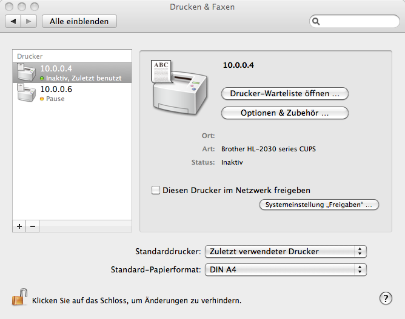
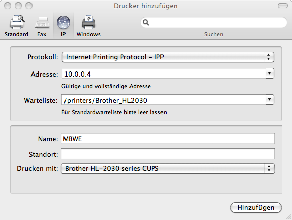
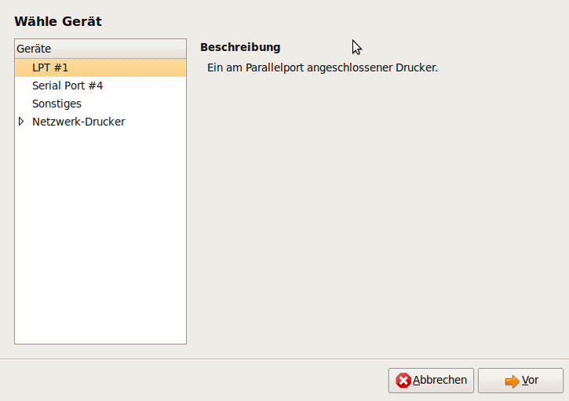
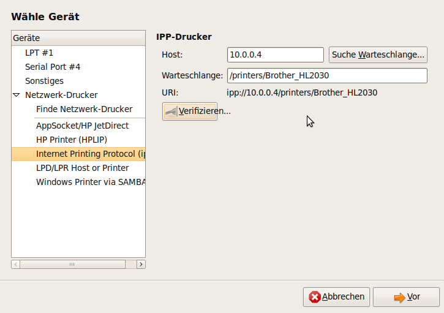
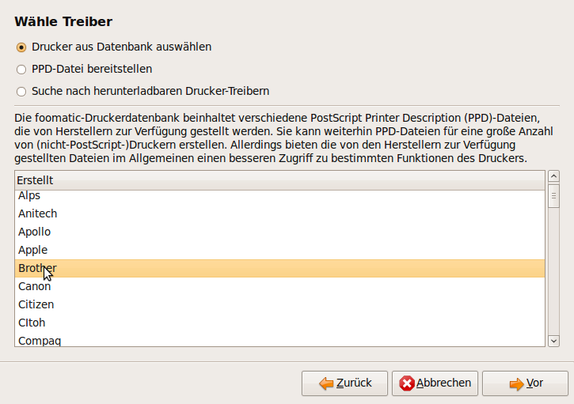
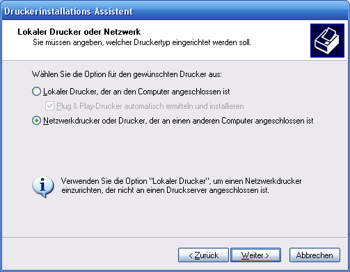
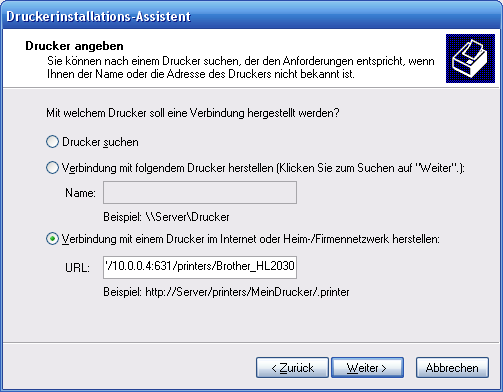
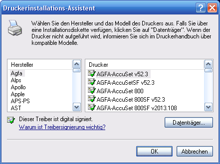
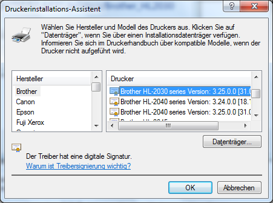

MyBook World Edition White Light Print Server
====

**Tested with Firmware 01.00.16, 01.00.18 and 01.01.16!**

### Updates: ###

* Firmware 01.01.16 tested
* Firmware 01.00.18 tested
* Addgroup for printing
* Printer test page
* Add printer with webinterface

Thanks to **mad_ady** and **Fidatelo** from [mybookworld.wikidot.com](http://mybookworld.wikidot.com/forum/t-180724/cups-on-mybook-we-white-light-a-torture#post-608513) for their feedback!

## Preparations ##

SSH must be activated on the MyBook through the web interface. Then you can connect to it with putty (user: root / password: welc0me).
First of all, Optware will be installed on the MBWE. The easy way is by using Frater's script:

	wget -O prep_whitelight http://wd.mirmana.com/prep_whitelight
	sh prep_whitelight

The installation may take a while.

## CUPS installation ##

The necessary packages can be installed by the package management system:

	/opt/bin/ipkg install cups
	/opt/bin/ipkg install cups-pdf
	/opt/bin/ipkg install cups-doc
	/opt/bin/ipkg install cups-driver-gutenprint

"cups-doc" is needed for the web configuration interface. To get the printer work with CUPS an additional kernel module is needed.

## Kernel module installation ##

I compiled this module from the Western Digital kernel (2.6.24.4) sourcen. 
The modules can be downloaded from GitHub:

	mkdir /lib/modules/2.6.24.4/kernel/drivers/usb/class/
	wget https://github.com/berwinter/mbwe/blob/master/modules/usblp.ko.whitelight?raw=true -O /lib/modules/2.6.24.4/kernel/drivers/usb/class/usblp.ko 

Now the module can be loaded with insmod. To do this on startup create a script with following content in /opt/etc/init.d/_SK88cupsd:

	#!/bin/sh
	#
	#
	#
	case "$1" in
		start)
		        if ( [ ! -c /dev/lp0 ] ) then
		                mknod /dev/lp0 c 180 0
		        fi
		        /bin/chown sys:lp /dev/lp0

		        if ( !(lsmod | grep "^usblp" -q) ); then
		                 insmod /lib/modules/2.6.24.4/kernel/drivers/usb/class/usblp.ko
		        fi

		        if [ -n "`pidof cupsd`" ]; then
		                /usr/bin/killall cupsd 2>/dev/null
		        fi
		        /opt/sbin/cupsd
		;;
		stop)
		        if [ -n "`pidof cupsd`" ]; then
		                /usr/bin/killall cupsd 2>/dev/null
		        fi
		;;
		*)
		        echo "Usage: (start|stop)"
		        exit 1
	esac

Create symbolic links for startup and shutdown:

	chmod +x _SK88cupsd
	ln -s _SK88cupsd S88cupsd
	ln -s _SK88cupsd K88cupsd

Add the group lp for printing permissions:

	addgroup lp

## Configure CUPS ##

The config of CUPS is stored in /opt/etc/cups/cupsd.conf

	# Show general information in error_log.
	LogLevel info
	MaxLogSize 100000
	MaxJobs 50
	User sys
	Group lp
	# Allow remote access
	Port 631
	MaxClients 10
	<Location />
	  Encryption Never
	  AuthType None
	  Deny From All
	  Allow From 127.0.0.1
	  Allow From 10.0.0.0/16
	  # Allow shared printing and remote administration...
	  # Order allow,deny
	  # Allow @LOCAL
	</Location>
	<Location /printers>
	  AuthType None
	  Order Deny,Allow
	  Deny From None
	  Allow From All
	</Location>
	<Location /admin>
	  Deny From All
	  Allow From 127.0.0.1
	  Allow From 10.0.0.0/16
	  # Allow remote administration...
	  # Order allow,deny
	  # Allow @LOCAL
	</Location>
	# Share local printers on the local network.
	Browsing On
	BrowseOrder allow,deny
	BrowseAddress @LOCAL
	<Location /admin/conf>
	  AuthType Default
	  Require user @SYSTEM
	  # Allow remote access to the configuration files...
	  # Order allow,deny
	  # Allow @LOCAL
	</Location>

Please change the lines with 10.0.0.0/16 to your network.

Start CUPS:

	/opt/etc/init.d/S88cupsd start

Check http://<ip_mbwe>:631/ for errors.

## Printer configuration ##

The printer configuration is stored in /opt/etc/cups/printers.conf

	<DefaultPrinter Brother_HL2030>
		Info Brother 2030 series
		Location Local Printer
		DeviceURI parallel:/dev/lp0
		State Idle
		StateTime 1252837845
		Accepting Yes
		Shared Yes
		JobSheets none none
		QuotaPeriod 0
		PageLimit 0
		KLimit 0
		OpPolicy default
		ErrorPolicy stop-printer
	</Printer>

The important line is DeviceURI parallel:/dev/lp0, which is the printer interface.

## Add printer (Webinterface) ##

You can also add a printer over the web interface (http://<ip_mbwe>:631/):

Administartion > Add printer > enter name > LPD/LPR Host or Printer > Device URI: parallel:/dev/lp0 > Raw > Raw Query

## MacOSX Client ##

System Settings > Printer > Add Printer:

Choose IP and Internet Printing Protocol  - IPP

Enter the IP Address of your MBWE and select the queue /printers/<Druckername>

Finally select a driver for your printer.

## Ubuntu Client ##

System > Administration > Printer > New > Network Printer

Internet Printing Protocol 
Enter the IP Address of your MBWE and select the queue /printers/<Druckername>

Select driver:

## Windows XP Client ##

Start > Printers and Faxes > Add Printer > Next

Network Printer ... > next > Connect to printer over the internet ...
http://<ip_mbwe>:631/printers/<Druckername>

next > select driver

next > finish

## Windows Vista Client ##

Start > Devices and Printers > Add Printer

Network Printer ... > next > Connect to printer over the internet ...
http://<ip_mbwe>:631/printers/<Druckername> eingeben

next > select driver

next > finish

## Tips and Tricks ##

If the queue ist stopped after restart, you can solve the problem with following modification in /opt/etc/init.d/_SK88cupsd (Thanks to Fidatelo)

	#!/bin/sh 
	# 
	# 
	# 
	case "$1" in 
		start) 
		        if ( [ ! -c /dev/lp0 ] ) then 
		                mknod /dev/lp0 c 180 0 
		        fi 
		        /bin/chown sys:lp /dev/lp0 

		        if ( !(lsmod | grep "^usblp" -q) ); then 
		                 insmod /lib/modules/2.6.24.4/kernel/drivers/usb/class/usblp.ko 
		        fi 

		        if [ -n "`pidof cupsd`" ]; then 
		                /usr/bin/killall cupsd 2>/dev/null 
		        fi 
		        /opt/sbin/cupsd
		        sleep 10
		        /opt/sbin/cupsenable HP-Deskjet-812c
		;; 
		stop) 
		        if [ -n "`pidof cupsd`" ]; then 
		                /usr/bin/killall cupsd 2>/dev/null 
		        fi 
		;; 
		*) 
		        echo "Usage: (start|stop)" 
		        exit 1 
	esac

## Contact ##

Bertram Winter
bertram.winter@gmail.com
